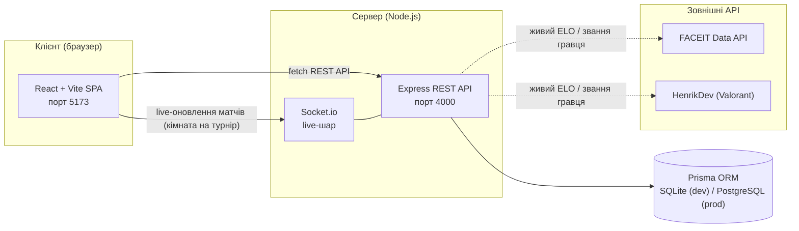
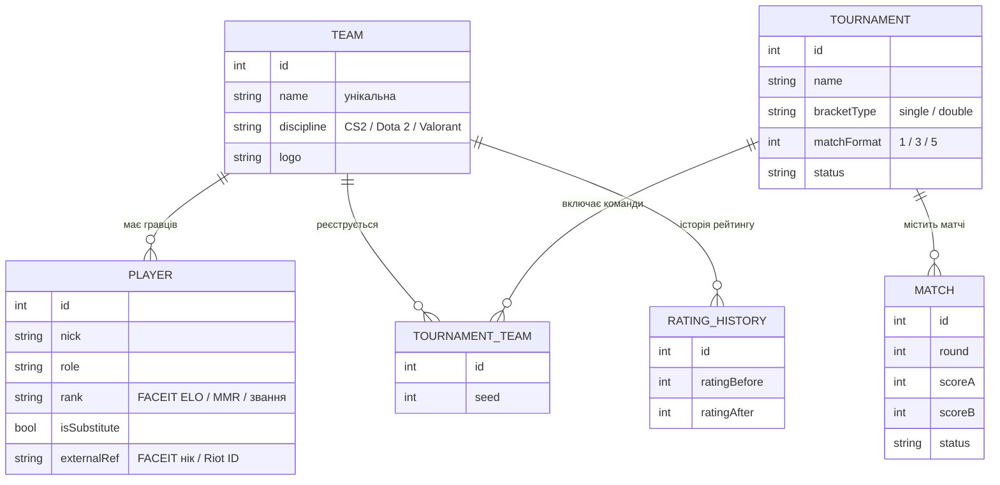

<div align="center">


<br/>


</div>

---

## Команда розробки

<div align="center">

| | Верещагін Сергій | Герасимов Володимир |
|---|:---:|:---:|
| **Роль** | Backend / алгоритми | Frontend / UX |
| **GitHub** | [](https://github.com/zelonka228) | [](https://github.com/MUMITROLIK) |
| **Discord** |  |  |

</div>

---

## Зміст

- [Команда розробки](#команда-розробки)
- [Про проєкт](#про-проєкт)
- [Функціонал](#функціонал)
- [Архітектура](#архітектура)
- [Модель даних](#модель-даних)
- [Технологічний стек](#технологічний-стек)
- [Структура репозиторію](#структура-репозиторію)
- [Швидкий старт](#швидкий-старт)
- [Статус за тижнями](#статус-за-тижнями)
- [Документація](#документація)

---

## Про проєкт

Аматорські турніри та LAN-вечірки досі ведуть в Excel або в чаті, сітку на 16+ учасників малюють вручну (і вручну ж помиляються), а існуючі сервіси (Challonge, Toornament, Battlefy) дають лише сухі таблиці й дерева матчів — жодного «відчуття гри».

**ARENA / TourneyForge** — це можливість створити турнір за хвилину, отримати сітку автоматично, вести результати наживо та отримати «прокачаний» профіль команди з живою статистикою, складом і рейтингом.

### Чим відрізняємось від аналогів

| Критерій | Challonge | Toornament | Battlefy | **ARENA** |
|---|---|---|---|---|
| Онбординг | середній | складний | простий | **простий (3 поля)** |
| Профіль команди між турнірами | немає | частково | є | **наскрізний, з історією** |
| Рейтинг | лише в турнірі | частково | профільний | **середній по грі (FACEIT ELO / MMR / звання)** |
| Живий профіль гравця | немає | немає | немає | **FACEIT / tracker.gg підтягуються автоматично** |
| Live-оновлення сітки | немає | частково | є | **WebSocket, без перезавантаження** |

### Ключова ідея рейтингу

Єдиної універсальної шкали між різними іграми не існує — тому рейтинг команди рахується як **середнє рейтингів її гравців у рідній одиниці дисципліни**:

| Дисципліна | Одиниця рейтингу | Приклад | Живі дані |
|---|---|---|:---:|
| CS2 | FACEIT ELO | 2198 | FACEIT Data API |
| Dota 2 | MMR | 5400 | вручну (Valve приховує MMR) |
| Valorant | Звання (Iron → Radiant) | Immortal | HenrikDev API |

Команди порівнюються лише в межах однієї дисципліни.

**[⬆ До змісту](#зміст)**

---

## Функціонал

Реалізовано станом на кінець Тижня 3:

- **Створення турніру** — назва, тип сітки, формат матчу BO1 / BO3 / BO5, дисципліна, дата; вибір команд-учасників з живим переглядом кількості раундів і матчів. Три режими посіву: випадковий, за рейтингом і **ручний** — з перестановкою команд стрілками на сторінці турніру перед генерацією сітки.
- **Турнірна сітка** — генерується на бекенді (стандартний посів, «баї» лише в 1-му раунді, автопрохід без матчу); анімовані з'єднувальні лінії з пульсом-«імпульсом», коли переможець проходить у наступний раунд.
- **Ввід рахунку** — валідується під формат матчу турніру (наприклад, 2:0 або 2:1 для BO3), переможець автоматично проходить у наступний раунд; повторне редагування завершеного матчу заблоковано.
- **Live-оновлення** — Socket.io-кімната на кожен турнір: щойно хтось вводить рахунок, усі відкриті вкладки цього турніру оновлюються без перезавантаження сторінки.
- **Живий профіль гравця** — прив'язка FACEIT-акаунту (CS2) або Riot ID (Valorant) підтягує реальний ELO/звання, аватар і статистику прямо в картку гравця; неонові бейджі-посилання ведуть на зовнішній профіль.
- **Команда** — редактор складу (основа + запасні), ролі гравців залежать від дисципліни, середній рейтинг команди рахується автоматично.
- **Профіль команди** — картка з winrate, стріком перемог, кількістю турнірів, найкращим результатом і повним складом.
- **Загальний рейтинг** — таблиця команд платформи з фільтром за дисципліною.
- **Backend REST API** (Express + Prisma) — CRUD команд і турнірів, генерація сітки (single/double elimination), ввід рахунку, валідація вхідних даних, єдина обробка помилок (`400` / `404` / `409`), 56 автоматизованих тестів.
- **Автономний фронтенд** — якщо backend недоступний, `api.js` м'яко повертається на демонстраційні дані для перегляду; дії, що змінюють дані, потребують живого бекенду.

Подвійне вибування реалізовано для кількості команд-степенів двійки (4/8/16/32) — див. [docs/03-double-elimination-spec.md](docs/03-double-elimination-spec.md). RPG-картка команди з PNG-експортом — див. [docs/04-rpg-card-spec.md](docs/04-rpg-card-spec.md). Далі за планом (Тиждень 4): фінальне тестування, звіт — див. [Статус за тижнями](#статус-за-тижнями).

**[⬆ До змісту](#зміст)**

---

## Архітектура



Якщо backend недоступний, фронтенд автоматично перемикається на локальні демонстраційні дані (`lib/demo.js`) — застосунок ніколи не «падає» через відсутність API.

**[⬆ До змісту](#зміст)**

---

## Модель даних



**[⬆ До змісту](#зміст)**

---

## Технологічний стек

| Шар | Рішення | Обґрунтування |
|---|---|---|
| Frontend | React + Vite (JavaScript) | компонентний підхід, зручний для динамічної сітки й карток |
| Стилі та анімації | Tailwind CSS + Framer Motion | утилітарні класи + декларативні анімації без окремого CSS-in-JS |
| Backend | Node.js + Express (ESM) | одна мова з фронтендом, швидка розробка, рідний Socket.io |
| База даних | Prisma ORM → SQLite (dev) / PostgreSQL (prod) | одна схема, перемикання провайдера через `DATABASE_URL` |
| Реальний час | Socket.io (WebSocket) | live-оновлення результатів матчів, кімната на кожен турнір |
| Зовнішні дані | FACEIT Data API, HenrikDev (Valorant) | живий ELO/звання гравця замість статичного вручну введеного числа |
| Тестування API | власний smoke-suite (без залежностей) | 36 сценаріїв happy-path + помилок |

**[⬆ До змісту](#зміст)**

---

## Структура репозиторію

```
frontend/          React-застосунок
  src/pages/         сторінки (Landing, Create, Tournament, Team, Profile, Hall)
  src/components/     спільні UI-примітиви (arena.jsx) + motion.jsx (анімації)
  src/lib/           demo.js (демо-дані) + api.js (шар API з фолбеком) + i18n.jsx
backend/            Express REST API + Prisma + Socket.io
  prisma/            schema.prisma, seed.js, dev.db
  src/routes/        teams.js, tournaments.js, matches.js, players.js
  src/integrations/  FACEIT / HenrikDev (Valorant) клієнти
  src/bracket.js     посів, побудова сітки, валідація рахунку
  src/advance.js     проштовхування переможця в наступний раунд, авто-баї
  src/http.js        валідація та єдина обробка помилок
  test-api.js        smoke-тести API (npm test)
docs/               специфікації для синхронізації напрямів роботи
```

**[⬆ До змісту](#зміст)**

---

## Швидкий старт

**Backend** (перше вікно):
```bash
cd backend
npm install
npm run db:push      # створити dev.db зі схеми
npm run db:seed      # залити демо-команди
npm run start        # http://localhost:4000
```

**Frontend** (друге вікно):
```bash
cd frontend
npm install
npm run dev           # http://localhost:5173
```

**Smoke-тести API** (бекенд має бути запущений):
```bash
cd backend
npm test
```

Фронтенд працює і без бекенду: якщо API недоступний, `frontend/src/lib/api.js` автоматично повертає демо-дані. URL бекенду задається змінною оточення `VITE_API_URL` (див. `frontend/.env.example`). Живі профілі гравців (FACEIT/Valorant) — опціональні, ключі задаються в `backend/.env` (див. `backend/.env.example`).

**[⬆ До змісту](#зміст)**

---

## Статус за тижнями

| № | Завдання | Тиждень | Статус |
|---|---|:---:|---|
| 1 | Аналіз ринку: дослідження аналогів (Challonge, Toornament, Battlefy) | 1 |  |
| 2 | Формування концепції проєкту та переваг над аналогами | 1 |  |
| 3 | Аналіз архітектури аналогічних застосунків | 1 |  |
| 4 | Аналіз UX аналогів та проєктування структури сторінок | 1–2 |  |
| 5 | Проєктування архітектури застосунку: вибір стеку | 2 |  |
| 6 | Проєктування структури бази даних (6 сутностей) | 2 |  |
| 7 | Розробка backend API: турніри, реєстрація команд | 2–3 |  |
| 8 | Алгоритм генерації турнірної сітки (single/double elimination) | 3 |  |
| 9 | Рейтингова система команд | 3 |  |
| 10 | Live-оновлення результатів матчів (WebSocket) | 3–4 |  |
| 11 | Frontend-візуалізація турнірної сітки | 3–4 |  |
| 12 | Генератор RPG-карток команд (PNG-експорт) | 4 |  |
| 13 | Тестування, виправлення помилок, звіт з практики | 4 |  |

**[⬆ До змісту](#зміст)**

---

## Документація

- [docs/02-week2-spec.md](docs/02-week2-spec.md) — контракт схеми БД та REST API.
- [docs/03-double-elimination-spec.md](docs/03-double-elimination-spec.md) — специфікація подвійного вибування.
- [docs/04-rpg-card-spec.md](docs/04-rpg-card-spec.md) — специфікація RPG-картки команди.

Академічні деліверабли практики (звіт, календарний графік, щоденники) до репозиторію не входять — ведуться окремо.

**[⬆ До змісту](#зміст)**
