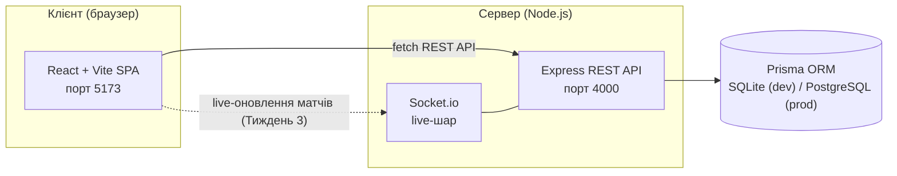
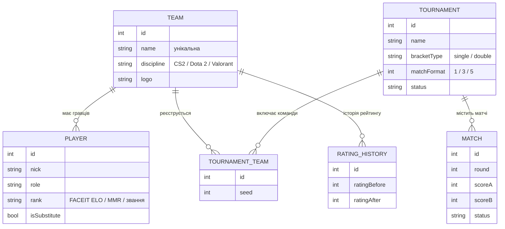

<div align="center">

# 🏆 Турнірна платформа — TourneyForge

**Турніри та LAN-вечірки з автоматичною сіткою, live-результатами та RPG-картками команд**


</div>

---

## Команда розробки

<div align="center">

| | Верещагін Сергій | Герасимов Володимир |
|---|:---:|:---:|
| **Роль** | Backend / алгоритми | Frontend / UX |
| **GitHub** | [](https://github.com/zelonka228) | [](https://github.com/MUMITROLIK) |
| **Discord** |  |  |

</div>

---

## Зміст

- [Команда розробки](#команда-розробки)
- [Про проєкт](#про-проєкт)
- [Функціонал](#функціонал)
- [Архітектура](#архітектура)
- [Модель даних](#модель-даних)
- [Технологічний стек](#технологічний-стек)
- [Структура репозиторію](#структура-репозиторію)
- [Швидкий старт](#швидкий-старт)
- [Статус за тижнями](#статус-за-тижнями)
- [Документація](#документація)

---

## Про проєкт

Аматорські турніри та LAN-вечірки досі ведуть в Excel або в чаті, сітку на 16+ учасників малюють вручну (і вручну ж помиляються), а існуючі сервіси (Challonge, Toornament, Battlefy) дають лише сухі таблиці й дерева матчів — жодного «відчуття гри».

**TourneyForge** — це можливість створити турнір за хвилину, отримати сітку автоматично, вести результати наживо та отримати «прокачаний» профіль команди у вигляді RPG-картки зі статистикою, складом і рейтингом.

### Чим відрізняємось від аналогів

| Критерій | Challonge | Toornament | Battlefy | **TourneyForge** |
|---|---|---|---|---|
| Онбординг | середній | складний | простий | **простий (3 поля)** |
| Профіль команди між турнірами | немає | частково | є | **наскрізний, з історією** |
| Рейтинг | лише в турнірі | частково | профільний | **середній по грі (FACEIT ELO / MMR / звання)** |
| Гейміфікація | немає | немає | немає | **RPG-картка команди** |

### Ключова ідея рейтингу

Єдиної універсальної шкали між різними іграми не існує — тому рейтинг команди рахується як **середнє рейтингів її гравців у рідній одиниці дисципліни**:

| Дисципліна | Одиниця рейтингу | Приклад |
|---|---|---|
| CS2 | FACEIT ELO | 2198 |
| Dota 2 | MMR | 5400 |
| Valorant | Звання (Iron → Radiant) | Immortal |

Команди порівнюються лише в межах однієї дисципліни.

**[⬆ До змісту](#зміст)**

---

## Функціонал

Реалізовано станом на кінець Тижня 2:

- **Створення турніру** — назва, тип сітки (на вибування / подвійне вибування), кількість команд, формат матчу BO1 / BO3 / BO5, дисципліна, дата, тип посіву — з живим переглядом кількості раундів і матчів ще до створення.
- **Турнірна сітка** — вкладки *Сітка / Результати / Команди*; введення рахунку валідується під обраний формат матчу (наприклад, 2:0 або 2:1 для BO3), переможець автоматично проходить у наступний раунд, порожній слот показується як «—».
- **Команда** — редактор складу (основа + запасні), ролі гравців залежать від дисципліни, поле рейтингу — число (FACEIT ELO / MMR) або звання (Valorant), середній рейтинг команди рахується автоматично.
- **Профіль команди** — RPG-картка з winrate, стріком перемог, кількістю турнірів, найкращим результатом і повним складом.
- **Загальний рейтинг** — таблиця команд платформи з фільтром за дисципліною.
- **Backend REST API** (Express + Prisma) — CRUD команд і турнірів, реєстрація команди в турнір, ендпоінт розрахунку рейтингу, валідація вхідних даних, єдина обробка помилок (`400` / `404` / `409`), 19 автоматизованих тестів.
- **Автономний фронтенд** — якщо backend недоступний, `api.js` м'яко повертається на демонстраційні дані; застосунок лишається повністю робочим.

Далі за планом (Тижні 3–4): генерація сітки на бекенді, live-оновлення результатів через WebSocket, PNG-експорт RPG-картки — див. [Статус за тижнями](#статус-за-тижнями).

**[⬆ До змісту](#зміст)**

---

## Архітектура



Якщо backend недоступний, фронтенд автоматично перемикається на локальні демонстраційні дані (`lib/demo.js`) — застосунок ніколи не «падає» через відсутність API.

**[⬆ До змісту](#зміст)**

---

## Модель даних



**[⬆ До змісту](#зміст)**

---

## Технологічний стек

| Шар | Рішення | Обґрунтування |
|---|---|---|
| Frontend | React + Vite (JavaScript) | компонентний підхід, зручний для динамічної сітки й карток |
| Backend | Node.js + Express (ESM) | одна мова з фронтендом, швидка розробка, рідний Socket.io |
| База даних | Prisma ORM → SQLite (dev) / PostgreSQL (prod) | одна схема, перемикання провайдера через `DATABASE_URL` |
| Реальний час | Socket.io (WebSocket) | live-оновлення результатів матчів |
| Тестування API | власний smoke-suite (`node --test`-style, без залежностей) | 19 сценаріїв happy-path + помилок |

**[⬆ До змісту](#зміст)**

---

## Структура репозиторію

```
frontend/          React-застосунок
  src/pages/        сторінки (Landing, Create, Tournament, Team, Profile, Hall)
  src/lib/          demo.js (демо-дані) + api.js (шар API з фолбеком)
backend/            Express REST API + Prisma
  prisma/           schema.prisma, seed.js, dev.db
  src/routes/       teams.js, tournaments.js
  src/http.js       валідація та єдина обробка помилок
  test-api.js       smoke-тести API (npm test)
docs/               специфікації для синхронізації напрямів роботи
```

**[⬆ До змісту](#зміст)**

---

## Швидкий старт

**Backend** (перше вікно):
```bash
cd backend
npm install
npm run db:push      # створити dev.db зі схеми
npm run db:seed      # залити 8 демо-команд
npm run start        # http://localhost:4000
```

**Frontend** (друге вікно):
```bash
cd frontend
npm install
npm run dev           # http://localhost:5173
```

**Smoke-тести API** (бекенд має бути запущений):
```bash
cd backend
npm test
```

Фронтенд працює і без бекенду: якщо API недоступний, `frontend/src/lib/api.js` автоматично повертає демо-дані. URL бекенду задається змінною оточення `VITE_API_URL` (див. `frontend/.env.example`).

**[⬆ До змісту](#зміст)**

---

## Статус за тижнями

| № | Завдання | Тиждень | Статус |
|---|---|:---:|:---:|
| 1 | Аналіз ринку: дослідження аналогів (Challonge, Toornament, Battlefy) | 1 | ✅ |
| 2 | Формування концепції проєкту та переваг над аналогами | 1 | ✅ |
| 3 | Аналіз архітектури аналогічних застосунків | 1 | ✅ |
| 4 | Аналіз UX аналогів та проєктування структури сторінок | 1–2 | ✅ |
| 5 | Проєктування архітектури застосунку: вибір стеку | 2 | ✅ |
| 6 | Проєктування структури бази даних (6 сутностей) | 2 | ✅ |
| 7 | Розробка backend API: турніри, реєстрація команд | 2–3 | 🔄 |
| 8 | Алгоритм генерації турнірної сітки (single/double elimination) | 3 | ⏳ |
| 9 | Рейтингова система команд | 3 | ⏳ |
| 10 | Live-оновлення результатів матчів (WebSocket) | 3–4 | ⏳ |
| 11 | Frontend-візуалізація турнірної сітки | 3–4 | ⏳ |
| 12 | Генератор RPG-карток команд (PNG-експорт) | 4 | ⏳ |
| 13 | Тестування, виправлення помилок, звіт з практики | 4 | ⏳ |

✅ виконано · 🔄 у процесі · ⏳ заплановано

**[⬆ До змісту](#зміст)**

---

## Документація

- [docs/02-week2-spec.md](docs/02-week2-spec.md) — контракт схеми БД та REST API.

Академічні деліверабли практики (звіт, календарний графік, щоденники) до репозиторію не входять — ведуться окремо.

**[⬆ До змісту](#зміст)**
