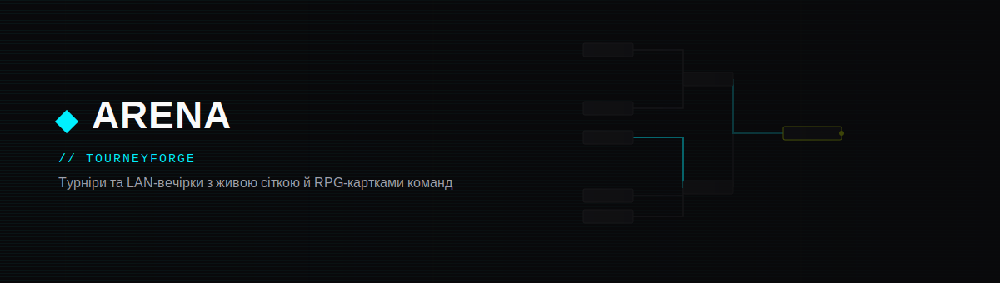
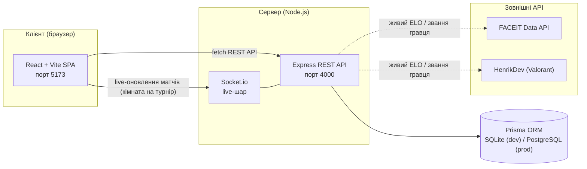
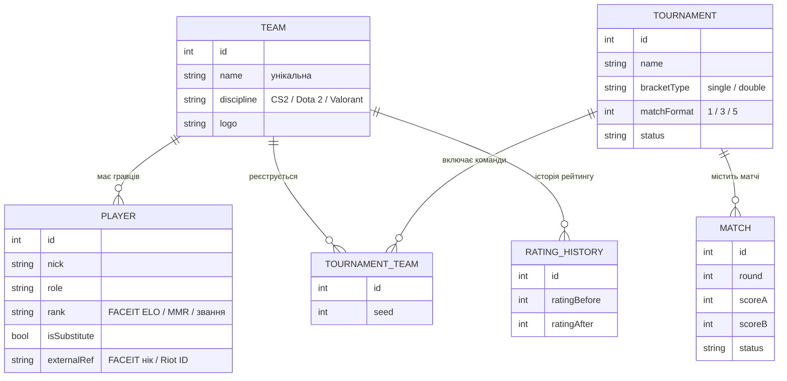

<div align="center">



<br/>


**[🚀 Живий демо-стенд](https://tourneyforge-frontend.onrender.com)** — розгорнуто на Render.com (безкоштовний план, перший запит після простою може займати ~30с)

</div>

---

## Команда розробки

<div align="center">

| | Верещагін Сергій | Герасимов Володимир |
|---|:---:|:---:|
| **Роль** | Backend / алгоритми | Frontend / UX |
| **GitHub** | [](https://github.com/zelonka228) | [](https://github.com/MUMITROLIK) |
| **Discord** |  |  |

</div>

---

## Зміст

- [Команда розробки](#команда-розробки)
- [Про проєкт](#про-проєкт)
- [Функціонал](#функціонал)
- [Архітектура](#архітектура)
- [Модель даних](#модель-даних)
- [Технологічний стек](#технологічний-стек)
- [Структура репозиторію](#структура-репозиторію)
- [Швидкий старт](#швидкий-старт)
- [Статус за тижнями](#статус-за-тижнями)
- [Документація](#документація)

---

## Про проєкт

Аматорські турніри та LAN-вечірки досі ведуть в Excel або в чаті, сітку на 16+ учасників малюють вручну (і вручну ж помиляються), а існуючі сервіси (Challonge, Toornament, Battlefy) дають лише сухі таблиці й дерева матчів — жодного «відчуття гри».

**ARENA / TourneyForge** — це можливість створити турнір за хвилину, отримати сітку автоматично, вести результати наживо та отримати «прокачаний» профіль команди з живою статистикою, складом і рейтингом.

### Чим відрізняємось від аналогів

| Критерій | Challonge | Toornament | Battlefy | **ARENA** |
|---|---|---|---|---|
| Онбординг | середній | складний | простий | **простий (3 поля)** |
| Профіль команди між турнірами | немає | частково | є | **наскрізний, з історією** |
| Рейтинг | лише в турнірі | частково | профільний | **середній по грі (FACEIT ELO / MMR / звання)** |
| Живий профіль гравця | немає | немає | немає | **FACEIT / tracker.gg підтягуються автоматично** |
| Live-оновлення сітки | немає | частково | є | **WebSocket, без перезавантаження** |

### Ключова ідея рейтингу

Єдиної універсальної шкали між різними іграми не існує — тому рейтинг команди рахується як **середнє рейтингів її гравців у рідній одиниці дисципліни**:

| Дисципліна | Одиниця рейтингу | Приклад | Живі дані |
|---|---|---|:---:|
| CS2 | FACEIT ELO | 2198 | FACEIT Data API |
| Dota 2 | MMR | 5400 | вручну (Valve приховує MMR) |
| Valorant | Звання (Iron → Radiant) | Immortal | HenrikDev API |

Команди порівнюються лише в межах однієї дисципліни.

**[⬆ До змісту](#зміст)**

---

## Функціонал

Проєкт завершено (Тиждень 4/4) — нижче повний перелік того, що реально працює на живому стенді, а не в плані.

**Турніри та сітка**
- Створення турніру — назва, тип сітки (single / double elimination), формат матчу BO1 / BO3 / BO5, дисципліна, дата.
- Три режими посіву команд: випадковий, за рейтингом і **ручний** — з перестановкою стрілками прямо на сторінці турніру перед генерацією сітки.
- Сітка генерується на бекенді (степені двійки 4/8/16/32 для double elimination — winners + losers bracket, «баї» лише в 1-му раунді); анімовані з'єднувальні лінії з пульсом, коли переможець проходить далі.
- Live-оновлення — Socket.io-кімната на кожен турнір: хтось вводить рахунок, усі відкриті вкладки цього турніру оновлюються без перезавантаження.
- Експорт турнірної сітки в PNG одним кліком.
- 3D-сцена трофея (Three.js / WebGL) для чемпіона турніру — обертова іконосфера з частками, ліниво довантажується окремим чанком, не впливає на вагу основного бандла.

**Команди, картки, рейтинг**
- Колекція команд у стилі RPG-карток з рідкістю (Common → Legendary), голографічною анімацією нахилу під курсором, PNG-експортом.
- Механіка відкриття паків для отримання карток команд.
- Живий профіль гравця — прив'язка FACEIT-акаунту (CS2) чи Riot ID (Valorant) підтягує реальний ELO/звання й статистику прямо в картку.
- Рейтинг команди — середнє по грі (FACEIT ELO / MMR / звання Valorant), рахується автоматично.
- Досягнення команди (бейджі за серії перемог, участь у турнірах тощо) на сторінці профілю.
- Профілі команд за прямим посиланням (`/profile/:id`), порівняння "команда проти команди" на окремій сторінці.
- Обране — команди можна закріпити зірочкою, вони спливають наверх у списках і в пошуку.

**Акаунти й адміністрування**
- Реєстрація та ролі: `admin` / `organizer` / `user` — керування турнірами й командами доступне лише організаторам і адмінам.
- JWT-автентифікація, рейт-ліміт на login/register, рольові перевірки завжди читають свіжий стан із БД (не з застарілого токена).
- Окрема адмін-панель (локальний інструмент, поза основним сайтом) — перегляд і керування користувачами/командами/турнірами на проді, з превʼю аватарок і лого команд, пошуком і фільтрами по кожній таблиці.

**UX**
- Глобальний пошук (`Ctrl+K`) по командах і турнірах з окремою секцією обраного.
- Інтерактивний частковий фон на головній (частки, що тягнуться до курсора).
- Локалізація на 3 мови — українська, російська, англійська.
- Анімовані переходи між сторінками, індикатор активної вкладки в навігації, повага до `prefers-reduced-motion` в усіх анімаціях.
- Автономний фронтенд — якщо backend недоступний, `api.js` м'яко повертається на демонстраційні дані для перегляду.

**Інфраструктура**
- Розгорнуто на Render.com: PostgreSQL + backend (Node) + статичний фронтенд, одним Blueprint-файлом (`render.yaml`).
- GitHub Actions пінгує безкоштовний backend раз на кілька хвилин, щоб він не засинав.
- Продакшн-міграції БД через Prisma migrations (без ризикованого `db push` на живих даних).
- Backend: власний smoke-suite (без залежностей). Frontend: Vitest + Testing Library.

Специфікації: подвійне вибування — [docs/03-double-elimination-spec.md](docs/03-double-elimination-spec.md); RPG-картка — [docs/04-rpg-card-spec.md](docs/04-rpg-card-spec.md); реєстрація/ролі/адмінка — [docs/05-auth-registration-spec.md](docs/05-auth-registration-spec.md); деплой — [docs/06-deploy-render.md](docs/06-deploy-render.md).

**[⬆ До змісту](#зміст)**

---

## Архітектура



Якщо backend недоступний, фронтенд автоматично перемикається на локальні демонстраційні дані (`lib/demo.js`) — застосунок ніколи не «падає» через відсутність API.

**[⬆ До змісту](#зміст)**

---

## Модель даних



**[⬆ До змісту](#зміст)**

---

## Технологічний стек

| Шар | Рішення | Обґрунтування |
|---|---|---|
| Frontend | React + Vite (JavaScript) | компонентний підхід, зручний для динамічної сітки й карток |
| Стилі та анімації | Tailwind CSS + Framer Motion | утилітарні класи + декларативні анімації без окремого CSS-in-JS |
| 3D-графіка | Three.js + @react-three/fiber / drei | процедурна сцена трофея без зовнішніх 3D-моделей, лінивим чанком |
| Backend | Node.js + Express (ESM) | одна мова з фронтендом, швидка розробка, рідний Socket.io |
| Автентифікація | JWT (jsonwebtoken) + bcryptjs, express-rate-limit | ролі admin/organizer/user, захист login/register від перебору |
| База даних | Prisma ORM → SQLite (dev) / PostgreSQL (prod) | одна схема, перемикання провайдера через `DATABASE_URL`, продакшн-міграції |
| Реальний час | Socket.io (WebSocket) | live-оновлення результатів матчів, кімната на кожен турнір |
| Зовнішні дані | FACEIT Data API, HenrikDev (Valorant) | живий ELO/звання гравця замість статичного вручну введеного числа |
| Тестування | власний smoke-suite (backend) + Vitest/Testing Library (frontend) | happy-path і помилкові сценарії з обох боків |
| Деплой | Render.com (Blueprint) + GitHub Actions | безкоштовний хостинг, keep-alive пінг проти "засинання" |

**[⬆ До змісту](#зміст)**

---

## Структура репозиторію

```
frontend/          React-застосунок
  src/pages/         Landing, Create, Tournament, Team, Collection, Player,
                      Profile, Compare, Hall, Login/Register/Account, AdminUsers
  src/components/    arena.jsx (UI-примітиви), TeamCard.jsx (RPG-картка),
                      VictoryScene.jsx (3D-трофей), GlobalSearch.jsx (Ctrl+K)
  src/lib/           demo.js (демо-дані), api.js (шар API з фолбеком),
                      i18n.jsx (UA/RU/EN), auth.jsx, favorites.js
admin-panel/        Окремий локальний інструмент адміністрування (не Vite/React) —
                      статичний HTML/JS + власний Node-сервер, ходить у прод-API
backend/            Express REST API + Prisma + Socket.io
  prisma/            schema.prisma (SQLite dev), schema.production.prisma (Postgres)
  src/routes/        teams.js, tournaments.js, matches.js, players.js, auth.js, adminUsers.js
  src/integrations/  FACEIT / HenrikDev (Valorant) клієнти
  src/bracket.js     посів, побудова сітки (single/double elimination), валідація рахунку
  src/advance.js     проштовхування переможця в наступний раунд, авто-баї
  src/http.js        валідація та єдина обробка помилок
  test-api.js        smoke-тести API (npm test)
docs/               специфікації для синхронізації напрямів роботи
render.yaml         Render.com Blueprint — БД + backend + static frontend одним файлом
```

**[⬆ До змісту](#зміст)**

---

## Швидкий старт

**Backend** (перше вікно):
```bash
cd backend
npm install
npm run db:push      # створити dev.db зі схеми
npm run db:seed      # залити демо-команди
npm run start        # http://localhost:4000
```

**Frontend** (друге вікно):
```bash
cd frontend
npm install
npm run dev           # http://localhost:5173
```

**Smoke-тести API** (бекенд має бути запущений):
```bash
cd backend
npm test
```

Фронтенд працює і без бекенду: якщо API недоступний, `frontend/src/lib/api.js` автоматично повертає демо-дані. URL бекенду задається змінною оточення `VITE_API_URL` (див. `frontend/.env.example`). Живі профілі гравців (FACEIT/Valorant) — опціональні, ключі задаються в `backend/.env` (див. `backend/.env.example`).

**[⬆ До змісту](#зміст)**

---

## Статус за тижнями

| № | Завдання | Тиждень | Статус |
|---|---|:---:|---|
| 1 | Аналіз ринку: дослідження аналогів (Challonge, Toornament, Battlefy) | 1 |  |
| 2 | Формування концепції проєкту та переваг над аналогами | 1 |  |
| 3 | Аналіз архітектури аналогічних застосунків | 1 |  |
| 4 | Аналіз UX аналогів та проєктування структури сторінок | 1–2 |  |
| 5 | Проєктування архітектури застосунку: вибір стеку | 2 |  |
| 6 | Проєктування структури бази даних (6 сутностей) | 2 |  |
| 7 | Розробка backend API: турніри, реєстрація команд | 2–3 |  |
| 8 | Алгоритм генерації турнірної сітки (single/double elimination) | 3 |  |
| 9 | Рейтингова система команд | 3 |  |
| 10 | Live-оновлення результатів матчів (WebSocket) | 3–4 |  |
| 11 | Frontend-візуалізація турнірної сітки | 3–4 |  |
| 12 | Генератор RPG-карток команд (PNG-експорт) | 4 |  |
| 13 | Тестування, виправлення помилок, звіт з практики | 4 |  |

**[⬆ До змісту](#зміст)**

---

## Документація

- [docs/02-week2-spec.md](docs/02-week2-spec.md) — контракт схеми БД та REST API.
- [docs/03-double-elimination-spec.md](docs/03-double-elimination-spec.md) — специфікація подвійного вибування.
- [docs/04-rpg-card-spec.md](docs/04-rpg-card-spec.md) — специфікація RPG-картки команди.
- [docs/05-auth-registration-spec.md](docs/05-auth-registration-spec.md) — реєстрація, ролі, особистий кабінет, адмінка.
- [docs/06-deploy-render.md](docs/06-deploy-render.md) — деплой на Render.com (безкоштовний хостинг).

Академічні деліверабли практики (звіт, календарний графік, щоденники) до репозиторію не входять — ведуться окремо.

**[⬆ До змісту](#зміст)**
